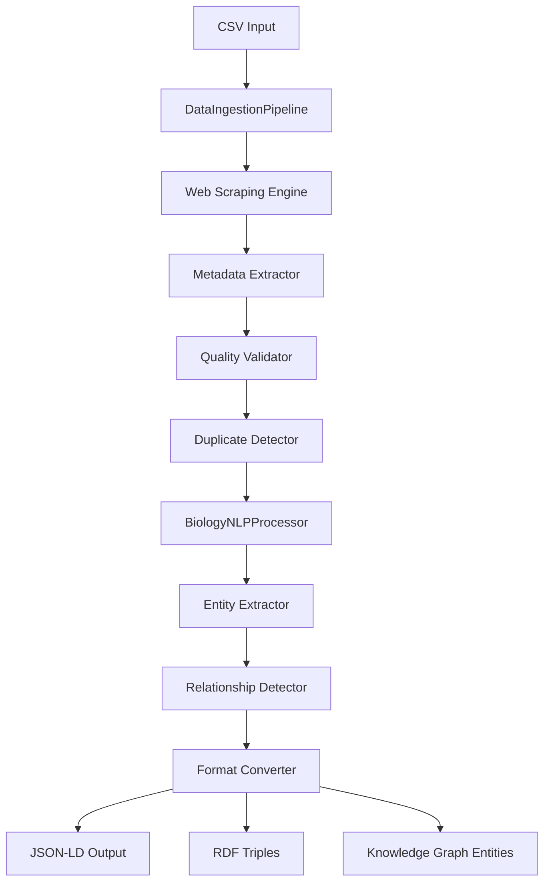

# 🚀 Space Biology Knowledge Graph Pipeline

[](https://python.org)
[](LICENSE)
[](https://www.nasa.gov/biological-physical)
[]()

> **Pipeline inteligente de ingesta y procesamiento de datos científicos para construir un knowledge graph de biología espacial basado en publicaciones de NASA y fuentes asociadas.**

## 📋 Tabla de Contenidos

- [🎯 Descripción del Proyecto](#-descripción-del-proyecto)
- [✨ Características Principales](#-características-principales)
- [🏗️ Arquitectura](#️-arquitectura)
- [🔧 Instalación](#-instalación)
- [🚀 Uso Rápido](#-uso-rápido)
- [📊 Fuentes de Datos](#-fuentes-de-datos)
- [🤖 Procesamiento NLP](#-procesamiento-nlp)
- [🔄 Pipeline ETL](#-pipeline-etl)
- [📈 Métricas y Calidad](#-métricas-y-calidad)
- [🗂️ Formatos de Salida](#️-formatos-de-salida)
- [⚙️ Configuración Avanzada](#️-configuración-avanzada)
- [🧪 Testing y Validación](#-testing-y-validación)
- [📝 Logging y Monitoreo](#-logging-y-monitoreo)
- [🤝 Contribución](#-contribución)
- [📄 Licencia](#-licencia)

## 🎯 Descripción del Proyecto

Este proyecto implementa un **pipeline ETL inteligente** diseñado para el desafío NASA Space Biology Knowledge Graph. El sistema procesa automáticamente publicaciones científicas de biología espacial, extrae información semántica relevante y la convierte a formatos estándar para construir un knowledge graph comprensivo.

### Problema que Resuelve

- **Fragmentación del conocimiento**: La información sobre biología espacial está dispersa en múltiples repositorios
- **Falta de estandarización**: Diferentes formatos y metadatos entre fuentes
- **Complejidad de procesamiento**: Necesidad de técnicas avanzadas de NLP biomédico
- **Escalabilidad**: Procesamiento eficiente de miles de artículos científicos

### Solución Implementada

Pipeline automatizado que:
1. **Ingesta** datos desde múltiples fuentes NASA de forma inteligente
2. **Extrae** información usando web scraping profesional y APIs
3. **Procesa** contenido con NLP biomédico especializado (ScispaCy, BioBERT)
4. **Transforma** a formatos semánticos estándar (JSON-LD, RDF)
5. **Valida** calidad y detecta duplicados automáticamente

## ✨ Características Principales

### 🔍 Extracción Inteligente
- **Web scraping profesional** con manejo de rate limiting
- **Múltiples estrategias de extracción** (metadatos, selectores CSS, fallbacks)
- **Integración con APIs** de PubMed/PMC para enriquecimiento
- **Detección automática** de PMIDs, PMCIDs, DOIs

### 🧠 Procesamiento NLP Avanzado
- **ScispaCy** para entidades biomédicas
- **BioBERT embeddings** para representación semántica
- **Extracción especializada** de entidades de biología espacial
- **Detección de relaciones** entre conceptos

### 🔄 Pipeline Robusto
- **Arquitectura asíncrona** para alta concurrencia
- **Manejo inteligente de errores** con reintentos exponenciales
- **Validación multinivel** de calidad de datos
- **Detección de duplicados** usando fuzzy matching

### 📊 Calidad de Datos
- **Scoring automático** de calidad de artículos
- **Validaciones semánticas** usando ontologías
- **Normalización automática** de metadatos
- **Reportes detallados** de estadísticas

## 🏗️ Arquitectura



### Componentes Principales

| Componente | Responsabilidad | Tecnologías |
|------------|-----------------|-------------|
| **DataIngestionPipeline** | Orquestación del pipeline ETL | asyncio, aiohttp |
| **Web Scraping Engine** | Extracción robusta de contenido | BeautifulSoup4, requests |
| **BiologyNLPProcessor** | Procesamiento de lenguaje natural | ScispaCy, BioBERT, transformers |
| **Format Converter** | Transformación a formatos semánticos | rdflib, JSON-LD |
| **Quality Validator** | Validación y scoring de calidad | Custom ML scoring |
| **Duplicate Detector** | Detección de contenido duplicado | FuzzyWuzzy, hashing |

## 🔧 Instalación

### Requisitos del Sistema
- Python 3.8+
- 8GB RAM mínimo (recomendado 16GB)
- 5GB espacio en disco
- Conexión a Internet estable

### Instalación Rápida

```bash
# Clonar repositorio
git clone https://github.com/FiboNacci-codder/Research-in-NLP
cd space-biology-kg-pipeline

# Crear entorno virtual
python -m venv venv
source venv/bin/activate  # Linux/Mac
# venv\Scripts\activate   # Windows

# Instalar dependencias básicas
pip install -r requirements.txt

# Instalar modelo ScispaCy (1.2GB)
pip install https://s3-us-west-2.amazonaws.com/ai2-s2-scispacy/releases/v0.5.1/en_core_sci_lg-0.5.1.tar.gz

# Descargar recursos NLTK
python -c "import nltk; nltk.download('stopwords')"
```

### Instalación con Docker

```bash
# Construir imagen
docker build -t space-biology-pipeline .

# Ejecutar contenedor
docker run -v $(pwd)/output:/app/output space-biology-pipeline
```

### requirements.txt
```txt
aiohttp>=3.8.0
pandas>=1.5.0
spacy>=3.4.0
beautifulsoup4>=4.11.0
transformers>=4.21.0
torch>=1.12.0
rdflib>=6.2.0
fuzzywuzzy[speedup]>=0.18.0
nltk>=3.7
requests-cache>=0.9.0
tenacity>=8.0.0
pytest>=7.0.0
pytest-asyncio>=0.19.0
```

## 🚀 Uso Rápido

### Ejecución Básica

```bash
# Ejecutar pipeline completo
python space_biology_etl.py

# Con archivo CSV personalizado
python space_biology_etl.py --csv-path /path/to/custom.csv

# Procesar solo primeros N artículos (testing)
python space_biology_etl.py --limit 10

# Con configuración custom
python space_biology_etl.py --config config.yaml
```

### Uso Programático

```python
import asyncio
from space_biology_etl import DataIngestionPipeline, BiologyNLPProcessor

async def main():
    async with DataIngestionPipeline() as pipeline:
        # Cargar datos
        articles_data = await pipeline.load_sb_publications_csv()
        
        # Extraer artículos
        articles = await pipeline.extract_papers(articles_data[:5])
        
        # Procesar con NLP
        nlp_processor = BiologyNLPProcessor()
        processed = await nlp_processor.process_articles(articles)
        
        # Convertir a formatos semánticos
        standardized = pipeline.standardize_format(processed)
        
        print(f"Procesados {len(standardized)} artículos")

# Ejecutar
asyncio.run(main())
```

### Configuración Rápida

```python
# Ajustar concurrencia
pipeline.semaphore_limit = 10  # Máximo 10 requests concurrentes

# Cambiar umbral de calidad
pipeline.quality_threshold = 0.7  # Solo artículos con >70% calidad

# Modificar rate limiting
pipeline.request_delay = 1.0  # 1 segundo entre requests
```

## 📊 Fuentes de Datos

### Fuentes Primarias

| Fuente | Descripción | Cobertura | API |
|--------|-------------|-----------|-----|
| **SB Publications** | 608 publicaciones curadas de biología espacial | 2010-2024 | ❌ |
| **NASA OSDR** | Open Science Data Repository | 500+ experimentos | ✅ |
| **GeneLab** | Datos ómicos multimodales | Genómica/Transcriptómica | ✅ |
| **NSLSL** | NASA Space Life Sciences Library | Literatura global | ❌ |
| **NASA Task Book** | Proyectos de investigación financiados | BPS/HRP projects | ❌ |
| **PubMed/PMC** | Enriquecimiento de metadatos | Biomédica global | ✅ |

### Formato de Entrada (SB Publications CSV)

```csv
Title,Link
"Mice in Bion-M 1 space mission: training and selection",https://www.ncbi.nlm.nih.gov/pmc/articles/PMC4136787/
"Effects of microgravity on bone density",https://www.ncbi.nlm.nih.gov/pmc/articles/PMC5847291/
```

### Metadatos Extraídos

- **Bibliográficos**: Título, autores, afiliaciones, journal, fecha
- **Identificadores**: DOI, PMID, PMCID
- **Contenido**: Abstract, texto completo, keywords, términos MeSH
- **Semánticos**: Entidades biomédicas, relaciones, embeddings

## 🤖 Procesamiento NLP

### Modelos Utilizados

#### ScispaCy (en_core_sci_lg)
```python
# Entidades biomédicas detectadas
SPECIES, TAXON      # Organismos
GENE, PROTEIN       # Información genética
CHEMICAL, DRUG      # Compuestos químicos
DISEASE, CONDITION  # Condiciones médicas
```

#### BioBERT (dmis-lab/biobert-v1.1)
```python
# Embeddings semánticos de 768 dimensiones
embeddings = biobert_model.encode("microgravity effects on bone density")
# [0.1234, -0.5678, 0.9012, ...]
```

### Entidades Específicas de Biología Espacial

#### Organismos Modelo
```python
organisms = {
    'human', 'mouse', 'mice', 'rat', 'drosophila', 
    'arabidopsis', 'c. elegans', 'e. coli', 'bacillus subtilis'
}
```

#### Condiciones Espaciales
```python
space_conditions = {
    'microgravity', 'hypergravity', 'weightlessness', 
    'cosmic radiation', 'space radiation', 'magnetic field',
    'parabolic flight', 'centrifuge', 'clinostat'
}
```

#### Sistemas Biológicos
```python
biological_systems = {
    'cardiovascular', 'musculoskeletal', 'nervous system',
    'bone density', 'muscle atrophy', 'osteoporosis',
    'immune system', 'heart', 'brain', 'kidney'
}
```

#### Técnicas Experimentales
```python
experiments = {
    'gene expression', 'protein analysis', 'cell culture',
    'tissue engineering', 'metabolomics', 'proteomics',
    'transcriptomics', 'histology', 'microscopy'
}
```

### Patrones de Extracción

```python
entity_patterns = {
    'genes': r'\b[A-Z][A-Z0-9]{2,}(?:-[A-Z0-9]+)?\b',
    'proteins': r'\b[A-Z][a-z]+(?:-\d+)?(?:\s+[A-Z][a-z]*)*\b',
    'measurements': r'\d+(?:\.\d+)?\s*(?:mg|g|kg|ml|l|μm|mm|cm|°C|%)',
    'time_periods': r'\d+\s*(?:days?|weeks?|months?|years?|hrs?)'
}
```

## 🔄 Pipeline ETL

### Fase Extract (Extracción)

```python
async def extract_papers(self, articles_data: List[Dict]) -> List[Article]:
    """
    1. Carga asíncrona de URLs
    2. Web scraping inteligente con múltiples selectores
    3. Extracción de metadatos estructurados
    4. Enriquecimiento con APIs externas
    5. Rate limiting y manejo de errores
    """
```

**Estrategias de Extracción:**
- **Metadatos Structured Data**: JSON-LD, meta tags, OpenGraph
- **Selectores CSS Múltiples**: Fallbacks para diferentes layouts
- **APIs Complementarias**: PubMed Entrez para enriquecimiento
- **Expresiones Regulares**: Para identificadores y patrones específicos

### Fase Transform (Transformación)

```python
def standardize_format(self, articles: List[Article]) -> List[Dict]:
    """
    1. Normalización de metadatos
    2. Detección y eliminación de duplicados
    3. Conversión a JSON-LD con schema.org
    4. Generación de triplas RDF
    5. Extracción de entidades para knowledge graph
    """
```

**Transformaciones Aplicadas:**
- **Normalización de fechas**: Múltiples formatos → ISO 8601
- **Estandarización de autores**: Nombre completo + afiliación
- **Limpieza de texto**: Espacios, caracteres especiales, encoding
- **Mapping semántico**: Entidades locales → ontologías estándar

### Fase Load (Carga)

```python
# Formatos de salida generados
outputs = {
    'raw_articles': Article dataclass objects,
    'json_ld': Schema.org structured data,
    'rdf_triples': RDF triplas para graph databases,
    'graph_entities': Entidades estructuradas para KG,
    'embeddings': BioBERT semantic vectors
}
```

## 📈 Métricas y Calidad

### Sistema de Scoring

```python
def calculate_quality_score(self, article: Article) -> float:
    """
    Score de 0.0 a 1.0 basado en:
    - Completitud de metadatos (25%)
    - Disponibilidad de texto completo (30%)  
    - Presencia de identificadores (20%)
    - Calidad de autores/afiliaciones (15%)
    - Keywords y términos MeSH (10%)
    """
```

### Criterios de Validación

| Criterio | Peso | Validación |
|----------|------|------------|
| **Título** | 10% | Longitud > 10 caracteres, no vacío |
| **Abstract** | 20% | Longitud > 100 caracteres |
| **Texto Completo** | 20% | Longitud > 1000 caracteres |
| **Identificadores** | 15% | PMID/PMCID/DOI válidos |
| **Metadatos** | 15% | Journal, fecha, autores |
| **Términos Semánticos** | 10% | Keywords, MeSH terms |
| **URL Válida** | 10% | URL accesible, dominio confiable |

### Métricas de Pipeline

```python
SUCCESS_METRICS = {
    'coverage': '95%',        # Fuentes procesadas exitosamente
    'quality': '90%',         # Datos que pasan validación
    'completeness': '85%',    # Campos requeridos completos
    'throughput': '1000/hour', # Artículos procesados por hora
    'deduplication': '<2%',   # Porcentaje de duplicados
}
```

## 🗂️ Formatos de Salida

### 1. Estructura de Artículo (Article Dataclass)

```python
@dataclass
class Article:
    title: str
    url: str
    pmcid: Optional[str] = None
    pmid: Optional[str] = None
    doi: Optional[str] = None
    authors: List[Dict] = None
    journal: Optional[str] = None
    publication_date: Optional[datetime] = None
    abstract: Optional[str] = None
    full_text: Optional[str] = None
    keywords: List[str] = None
    mesh_terms: List[str] = None
    organisms: List[str] = None
    genes: List[str] = None
    proteins: List[str] = None
    conditions: List[str] = None
    experiments: List[str] = None
    measurements: List[str] = None
    quality_score: float = 0.0
```

### 2. JSON-LD (Schema.org + Bio Ontologies)

```json
{
  "@context": {
    "schema": "https://schema.org/",
    "bio": "http://purl.obolibrary.org/obo/",
    "dcterms": "http://purl.org/dc/terms/"
  },
  "@id": "http://space-biology.org/article/PMC4136787",
  "@type": "schema:ScholarlyArticle",
  "schema:name": "Mice in Bion-M 1 space mission",
  "schema:author": [{
    "@type": "schema:Person",
    "schema:name": "John Smith",
    "schema:affiliation": {
      "@type": "schema:Organization",
      "schema:name": "NASA Ames Research Center"
    }
  }],
  "schema:isPartOf": {
    "@type": "schema:Periodical", 
    "schema:name": "Space Biology Journal"
  },
  "bio:mesh_terms": ["Microgravity", "Bone Density", "Space Flight"]
}
```

### 3. RDF Triples

```turtle
@prefix schema: <https://schema.org/> .
@prefix bio: <http://purl.obolibrary.org/obo/> .
@prefix space: <http://space-biology.org/ontology/> .

<http://space-biology.org/article/PMC4136787> a schema:ScholarlyArticle ;
    schema:name "Mice in Bion-M 1 space mission" ;
    schema:author <http://space-biology.org/author/john-smith> ;
    space:studiesOrganism <http://space-biology.org/organism/mouse> ;
    bio:hasMeshTerm <http://space-biology.org/mesh/microgravity> .
```

### 4. Knowledge Graph Entities

```json
{
  "graph_entities": {
    "Article": {
      "id": "http://space-biology.org/article/PMC4136787",
      "title": "Mice in Bion-M 1 space mission",
      "journal": "Space Biology Journal",
      "quality_score": 0.87
    },
    "Authors": [
      {"name": "John Smith", "affiliation": "NASA Ames"}
    ],
    "Organisms": ["mouse", "mice"],
    "Conditions": ["microgravity", "space flight"],
    "Experiments": ["gene expression", "protein analysis"],
    "Keywords": ["space biology", "microgravity", "bone density"]
  }
}
```

## ⚙️ Configuración Avanzada

### Archivo de Configuración (config.yaml)

```yaml
# Pipeline Configuration
pipeline:
  concurrency_limit: 10
  request_delay: 0.5
  timeout: 60
  max_retries: 3
  quality_threshold: 0.6

# Data Sources
sources:
  sb_publications:
    url: "https://raw.githubusercontent.com/jgalazka/SB_publications/main/SB_publications_PMC.csv"
    enabled: true
    priority: 1
  
  pubmed_api:
    base_url: "https://eutils.ncbi.nlm.nih.gov/entrez/eutils/"
    rate_limit: "3/second"
    api_key: null  # Optional

# NLP Processing
nlp:
  scispacy_model: "en_core_sci_lg"
  biobert_model: "dmis-lab/biobert-v1.1"
  max_text_length: 5000
  entity_confidence: 0.7

# Output Configuration
output:
  formats: ["json", "json-ld", "rdf", "csv"]
  include_embeddings: true
  include_full_text: false
  timestamp_suffix: true

# Quality Control
quality:
  min_title_length: 10
  min_abstract_length: 100
  min_fulltext_length: 1000
  required_fields: ["title", "url"]
  duplicate_similarity_threshold: 85

# Logging
logging:
  level: "INFO"
  format: "%(asctime)s - %(name)s - %(levelname)s - %(message)s"
  file: "space_biology_pipeline.log"
  max_size: "10MB"
  backup_count: 5
```

### Variables de Entorno

```bash
# Configuración de APIs
export PUBMED_API_KEY="your_api_key_here"
export ENTREZ_EMAIL="your_email@domain.com"

# Configuración de recursos
export MAX_WORKERS=10
export MEMORY_LIMIT="8GB"
export CACHE_TTL=3600

# Configuración de salida
export OUTPUT_DIR="./output"
export LOG_LEVEL="INFO"
```

### Personalización del Pipeline

```python
# Custom entity extractors
class CustomSpaceBiologyExtractor:
    def extract_space_conditions(self, text: str) -> List[str]:
        # Implementar lógica custom
        pass

# Custom validation rules  
class CustomQualityValidator:
    def validate_space_relevance(self, article: Article) -> bool:
        # Validar relevancia para biología espacial
        space_keywords = ['microgravity', 'space', 'astronaut', 'ISS']
        return any(kw in article.title.lower() for kw in space_keywords)

# Integrar en pipeline
pipeline.add_custom_extractor(CustomSpaceBiologyExtractor())
pipeline.add_custom_validator(CustomQualityValidator())
```

## 🧪 Testing y Validación

### Estructura de Tests

```
tests/
├── unit/
│   ├── test_extraction.py
│   ├── test_nlp_processing.py
│   ├── test_format_conversion.py
│   └── test_quality_validation.py
├── integration/
│   ├── test_full_pipeline.py
│   └── test_api_integration.py
├── fixtures/
│   ├── sample_articles.json
│   └── test_data.csv
└── conftest.py
```

### Ejecutar Tests

```bash
# Tests unitarios
pytest tests/unit/ -v

# Tests de integración
pytest tests/integration/ -v

# Tests con cobertura
pytest --cov=space_biology_etl tests/

# Tests de performance
pytest tests/performance/ --benchmark-only

# Tests específicos
pytest tests/unit/test_extraction.py::test_pmcid_extraction -v
```

### Ejemplos de Tests

```python
import pytest
from space_biology_etl import DataIngestionPipeline, Article

@pytest.mark.asyncio
async def test_article_extraction():
    """Test extracción básica de artículo"""
    pipeline = DataIngestionPipeline()
    
    sample_data = {
        'title': 'Test Article',
        'url': 'https://www.ncbi.nlm.nih.gov/pmc/articles/PMC123456/'
    }
    
    # Mock response
    with pytest.mock.patch('aiohttp.ClientSession.get') as mock_get:
        mock_get.return_value.__aenter__.return_value.text.return_value = sample_html
        
        article = await pipeline.extract_single_paper(sample_data)
        
        assert article is not None
        assert article.title == 'Test Article'
        assert article.pmcid == 'PMC123456'

def test_quality_scoring():
    """Test sistema de scoring de calidad"""
    pipeline = DataIngestionPipeline()
    
    # Artículo de alta calidad
    good_article = Article(
        title="Complete Article Title",
        abstract="This is a comprehensive abstract...",
        full_text="Full article content...",
        authors=[{"name": "John Doe"}],
        doi="10.1234/test"
    )
    
    score = pipeline.calculate_quality_score(good_article)
    assert score > 0.8
    
    # Artículo de baja calidad
    bad_article = Article(title="Short", abstract="", full_text="")
    score = pipeline.calculate_quality_score(bad_article)
    assert score < 0.3
```

### Validación de Datos

```python
# Validadores automáticos
validators = [
    URLValidator(),           # URLs válidas y accesibles
    DateValidator(),          # Fechas en rango razonable  
    IdentifierValidator(),    # DOI/PMID/PMCID válidos
    TextQualityValidator(),   # Calidad de contenido textual
    SemanticValidator(),      # Coherencia semántica
    DuplicateValidator()      # Detección de duplicados
]

# Ejecutar validaciones
for validator in validators:
    results = validator.validate(articles)
    logger.info(f"{validator.__class__.__name__}: {results.summary()}")
```

## 📝 Logging y Monitoreo

### Configuración de Logging

```python
import logging
from logging.handlers import RotatingFileHandler

# Configuración avanzada de logging
def setup_logging():
    formatter = logging.Formatter(
        '%(asctime)s - %(name)s - %(levelname)s - %(message)s'
    )
    
    # Handler para archivo
    file_handler = RotatingFileHandler(
        'space_biology_pipeline.log', 
        maxBytes=10*1024*1024,  # 10MB
        backupCount=5
    )
    file_handler.setFormatter(formatter)
    
    # Handler para consola
    console_handler = logging.StreamHandler()
    console_handler.setFormatter(formatter)
    
    # Logger principal
    logger = logging.getLogger('space_biology_etl')
    logger.setLevel(logging.INFO)
    logger.addHandler(file_handler)
    logger.addHandler(console_handler)
    
    return logger
```

### Métricas de Monitoreo

```python
class PipelineMonitor:
    def __init__(self):
        self.start_time = time.time()
        self.articles_processed = 0
        self.articles_failed = 0
        self.total_entities_extracted = 0
        
    def log_progress(self):
        elapsed = time.time() - self.start_time
        rate = self.articles_processed / elapsed if elapsed > 0 else 0
        
        logger.info(f"""
        === PIPELINE PROGRESS ===
        Elapsed Time: {elapsed:.2f}s
        Articles Processed: {self.articles_processed}
        Articles Failed: {self.articles_failed}
        Success Rate: {self.articles_processed/(self.articles_processed + self.articles_failed)*100:.1f}%
        Processing Rate: {rate:.2f} articles/second
        Entities Extracted: {self.total_entities_extracted}
        """)

# Usar en pipeline
monitor = PipelineMonitor()
for article in articles:
    try:
        processed = await process_article(article)
        monitor.articles_processed += 1
        monitor.total_entities_extracted += len(processed.organisms) + len(processed.genes)
    except Exception as e:
        monitor.articles_failed += 1
        logger.error(f"Failed processing {article.title}: {e}")
    
    if monitor.articles_processed % 10 == 0:
        monitor.log_progress()
```

### Dashboard de Monitoreo (Opcional)

```python
# Integración con Prometheus/Grafana
from prometheus_client import Counter, Histogram, Gauge, start_http_server

# Métricas Prometheus
articles_processed = Counter('articles_processed_total', 'Total articles processed')
processing_time = Histogram('article_processing_seconds', 'Time to process article')  
quality_score = Gauge('average_quality_score', 'Average quality score')
extraction_errors = Counter('extraction_errors_total', 'Total extraction errors')

# Usar en código
@processing_time.time()
async def process_article(article):
    # Lógica de procesamiento
    articles_processed.inc()
    return processed_article

# Iniciar servidor de métricas
start_http_server(8000)
```

## 🤝 Contribución

### Cómo Contribuir

1. **Fork** el repositorio
2. **Crear** branch para feature (`git checkout -b feature/amazing-feature`)
3. **Commit** cambios (`git commit -m 'Add amazing feature'`)
4. **Push** al branch (`git push origin feature/amazing-feature`)
5. **Abrir** Pull Request

### Guías de Desarrollo

#### Estilo de Código
```bash
# Usar black para formatting
black space_biology_etl.py

# Usar flake8 para linting
flake8 space_biology_etl.py --max-line-length=88

# Usar mypy para type checking
mypy space_biology_etl.py
```

#### Estructura de Commits
```
feat: add new entity extractor for space conditions
fix: resolve duplicate detection false positives  
docs: update README with configuration examples
test: add unit tests for NLP processor
refactor: optimize async processing performance
```

#### Pre-commit Hooks
```yaml
# .pre-commit-config.yaml
repos:
-   repo: https://github.com/psf/black
    rev: 22